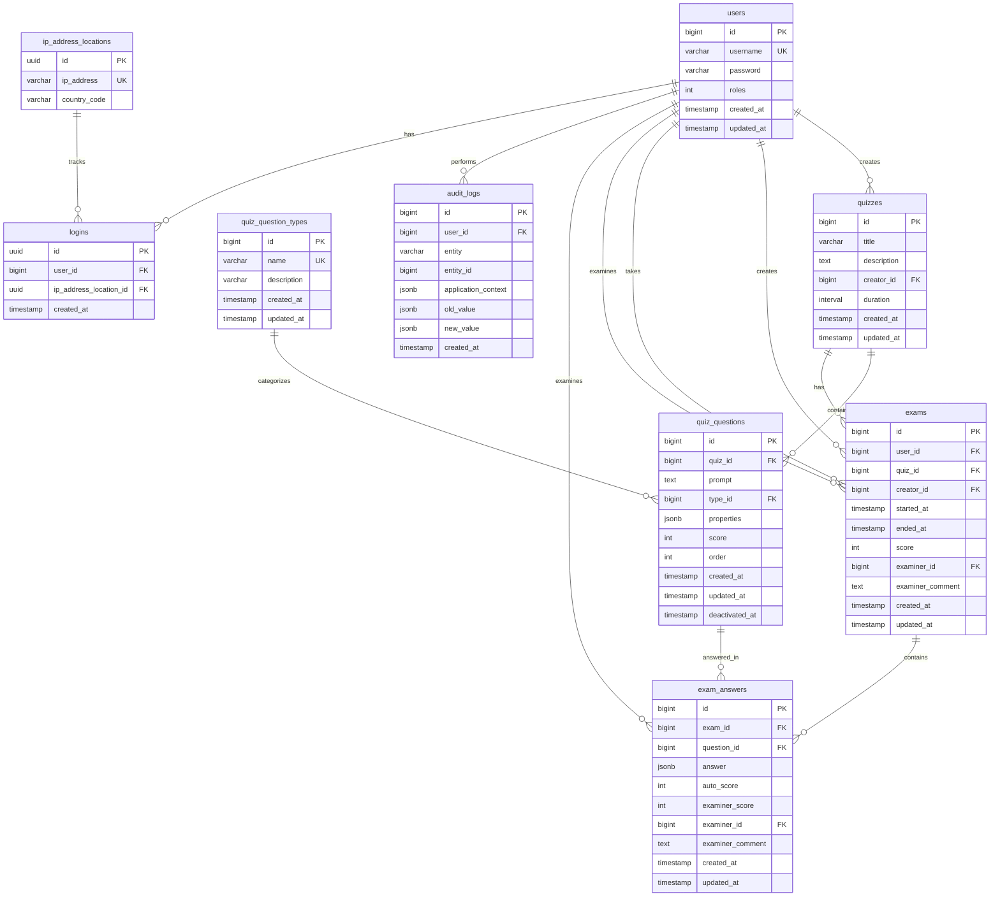

# Entity Relationship Diagram

## Relationships Summary

| From | To | Relationship | Foreign Key | On Delete |
|------|-----|--------------|-------------|-----------|
| `users` | `quizzes` | One-to-Many | `creator_id` | Restrict |
| `users` | `exams` | One-to-Many | `creator_id` | Restrict |
| `users` | `exams` | One-to-Many | `user_id` | Restrict |
| `users` | `exams` | One-to-Many | `examiner_id` | Restrict |
| `users` | `exam_answers` | One-to-Many | `examiner_id` | Restrict |
| `users` | `audit_logs` | One-to-Many | `user_id` | Restrict |
| `quizzes` | `quiz_questions` | One-to-Many | `quiz_id` | **Cascade** |
| `quizzes` | `exams` | One-to-Many | `quiz_id` | Restrict |
| `quiz_question_types` | `quiz_questions` | One-to-Many | `type_id` | Restrict |
| `quiz_questions` | `exam_answers` | One-to-Many | `question_id` | Restrict |
| `exams` | `exam_answers` | One-to-Many | `exam_id` | **Cascade** |
| `users` | `logins` | One-to-Many | `user_id` | **Cascade** |
| `ip_address_locations` | `logins` | One-to-Many | `ip_address_location_id` | Restrict |

## Indexes

| Table | Columns | Unique |
|-------|---------|--------|
| `users` | `username` | ✓ |
| `quiz_question_types` | `name` | ✓ |
| `quiz_questions` | `quiz_id`, `order` | |
| `exams` | `user_id`, `quiz_id` | |
| `exams` | `creator_id` | |
| `exam_answers` | `exam_id`, `question_id` | ✓ |
| `audit_logs` | `entity`, `entity_id` | |
| `audit_logs` | `user_id` | |
| `audit_logs` | `created_at` | |
| `ip_address_locations` | `ip_address` | ✓ |
| `logins` | `user_id` | |
| `logins` | `created_at` | |
